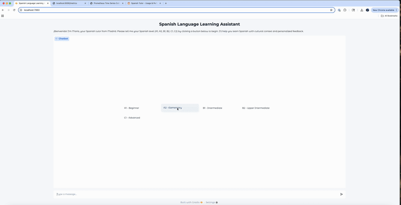

# 🇪🇸 Spanish Tutor

An AI-powered chatbot with adaptive conversation, robust error handling, and full-stack observability.


---

## 📚 Table of Contents
- [Architecture Overview](#architecture-overview)
- [Features](#features)
- [Demo](#demo)
- [Quick Start](#quick-start)
- [API Endpoints](#api-endpoints)
- [Observability](#observability)
- [Error Handling & Reliability](#error-handling--reliability)
- [Testing](#testing)
- [Configuration](#configuration)
- [Contributing](#contributing)
- [Acknowledgments](#acknowledgments)
- [Why This Project?](#why-this-project)

---

## Architecture Overview

- **Gradio UI**: Modern, chat-style web interface for learners.
- **FastAPI Backend**: Processes chat messages, handles errors, and exposes Prometheus metrics.
- **Ollama/OpenAI-Compatible LLM**: Local or remote LLM inference for cost-effective, private tutoring.
- **Prometheus & Grafana**: Real-time metrics, dashboards, and alerting.
- **Docker Compose**: Orchestrates all services for local or cloud deployment.

---

## Features

- Adaptive conversation practice (A1–C2 levels)
- Real-time English translation
- Robust error handling with custom exceptions and HTTP status codes
- Automatic retry logic for transient LLM/model failures
- Prometheus metrics for chat usage, latency, error types, and HTTP status codes
- Pre-built Grafana dashboards for usage, performance, and reliability
- Comprehensive test suite for core logic, API, and UI

---

## Demo




---

##  Quick Start

### 1. Clone the Repo & Set Up Environment

```bash
git clone https://github.com/camilleC/SpanishTutor.git
cd SpanishTutor
python -m venv venv
source venv/bin/activate
pip install -e .
```

### 2. Start Ollama for Local LLM

```bash
ollama run llama3
```

### 3. Launch All Services with Docker Compose

```bash
docker-compose up --build
```

#### Service URLs:
- Gradio UI → http://localhost:7860
- FastAPI API → http://localhost:8000
- Prometheus → http://localhost:9090
- Grafana → http://localhost:3000

---

##  API Endpoints

- `POST /chat` — Main chat endpoint. Handles retries and error mapping.
- `GET /health` — Health check.
- `GET /metrics` — Prometheus metrics endpoint.

---

## 📈 Observability

- Prometheus scrapes FastAPI metrics (latency, error rates, status codes, chat turns, etc.).
- Dashboards are auto-provisioned in Grafana.

To view dashboards:
1. Visit [http://localhost:3000](http://localhost:3000)
2. Log in with: `admin` / `admin`
3. Dashboards load from `grafana/dashboards/`

Dashboards:
- ✅ Usage & Performance
- 🚨 Reliability

---

## Error Handling & Reliability

- Custom exceptions:
  - `TutorModelUnavailable`
  - `TutorBadRequest`
  - `TutorInternalError`
- Automatic retry logic for transient model errors (up to 3 attempts)
- All errors mapped to appropriate HTTP status codes
- Prometheus counters track error types

---

## Testing

The test suite includes unit tests for:
- Core chat logic
- API request/response handling
- Gradio UI integration

To run tests:

```bash
pytest spanishtutor/tests/
pytest --cov=spanishtutor
```

---

##  Configuration

- Environment variables are managed in `docker-compose.yml`
- All Python dependencies are listed in `requirements.txt`
- Ollama model is assumed to be `llama3` (configurable)
- Use a .env file but do not check it into github. To start, use these values:

- API_URL=http://spanish-tutor-api:8000/chat
- LOG_LEVEL=info
- API_PORT=8000
- LOG_LEVEL=DEBUG
- MODEL_NAME=llama3.2
- LLM_BASE_URL=http://host.docker.internal:11434/v1
- LLM_API_KEY=ollama
- PROMETHEUS_SCRAPE_INTERVAL=5s
- GRAFANA_HOST_PORT=3000
- PROMETHEUS_HOST_PORT=9090
- GRAFANA_ADMIN_USER=admin
- GRAFANA_ADMIN_PASSWORD=admin


---

## Contributing

1. Fork this repo
2. Create a feature branch
3. Add tests for your changes
4. Open a pull request

---

## Acknowledgments

- [Ollama](https://ollama.com/)
- [Gradio](https://www.gradio.app/)
- [FastAPI](https://fastapi.tiangolo.com/)
- [Prometheus](https://prometheus.io/)
- [Grafana](https://grafana.com/)

---

## Why This Project?

SpanishTutor explores adding obervability, error handeling, and docker for project using llms.

